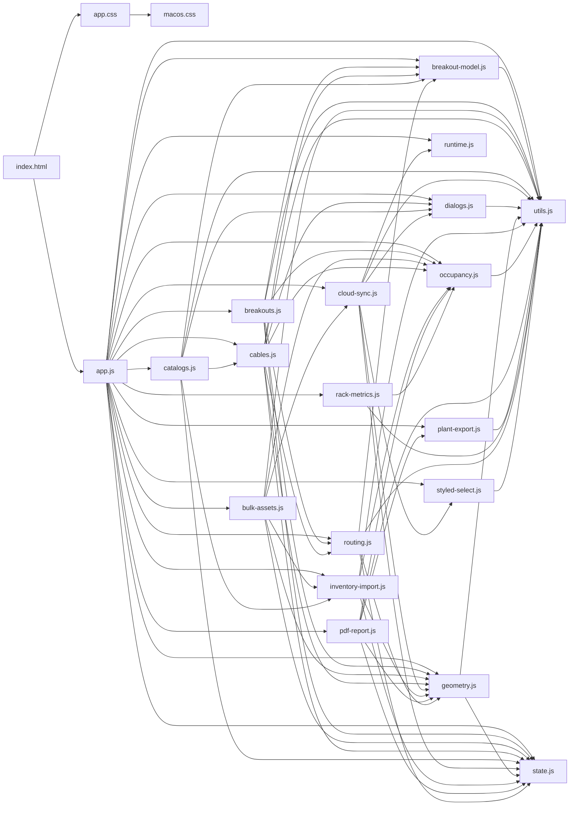

# SYSTEM-MAP — mapa do projeto

Gerado por `node scripts/system-map.mjs`. **Rode o script depois de mexer no código** para o
mapa continuar valendo (ele lê as linhas de verdade, não é escrito à mão).

Última geração: 2026-09-24 16:26 · app.js com 4567 linhas · 18 módulos em js/ · app.css 11556 · macos.css 3597

## 1. O que é o quê

| arquivo | papel |
|---|---|
| index.html | casca: barra de topo, duas laterais flutuantes, canvas, barra inferior e todos os modais |
| app.js | orquestra tudo: estado, render, interação do canvas e das laterais (`4567` linhas) |
| js/state.js | objeto `state` compartilhado (fonte da verdade em memória) |
| js/geometry.js | posições físicas de fileira/rack/calha + rótulo do rack (`rackDisplayName`, `findRackByLabel`) |
| js/routing.js | grafo de rota e cálculo de metragem de cabo |
| js/occupancy.js | ocupação de U por face, conflito e posição de asset |
| js/cables.js | lista de cabos, import/export XLSX e painel do cabo |
| js/catalogs.js | cadastros (tipos, fabricantes, modelos, salas) |
| js/bulk-assets.js + js/inventory-import.js | edição em massa e importação de planilha de assets |
| js/cloud-sync.js | salvar/carregar projeto na nuvem + status "Salvo" |
| js/rack-metrics.js | métricas do mapa de calor/resumo, sem DOM |
| app.css | camada base de estilo (tema claro e escuro por variáveis) |
| macos.css | camada de acabamento, **carregada depois do app.css** — quando as duas definem a mesma coisa, vale esta |

## 2. Módulos de js/ (exports e dependências)

| módulo | linhas | exporta (nome:linha) | importa de |
|---|---|---|---|
| `js/breakout-model.js` | 78 | breakoutLane:8, isBreakoutTypeName:12, normalizeBreakoutLengths:18, pickBreakoutLength:28, breakoutLegCable:36, groupBreakoutCables:49, resolveBreakoutType:69 | utils.js |
| `js/breakouts.js` | 135 | breakouts:10, configureBreakouts:12, breakoutCalc:25, setCablesTab:26, renderBreakoutsList:33, addBreakout:56, renderBreakoutProperties:65, breakoutSummaryRows:124 | utils.js, state.js, geometry.js, routing.js, breakout-model.js, occupancy.js |
| `js/bulk-assets.js` | 189 | configureBulkAssets:13, addBulkRow:162, openBulkAssetsModal:168, closeBulkAssetsModal:169, saveBulkAssets:170, openAssetsImportModal:178, bindImportUI:182 | utils.js, state.js, occupancy.js, inventory-import.js, cloud-sync.js, geometry.js |
| `js/cables.js` | 567 | cables:11, configureCables:17, addCable:22, downloadCableTemplate:115, importCablesXLSX:157, closeCableTypeReviewModal:213, processCableImportRows:217, cableCommercial:309, … | utils.js, state.js, dialogs.js, geometry.js, routing.js, occupancy.js, breakout-model.js |
| `js/catalogs.js` | 544 | catalogs:10, configureCatalogs:17, DEFAULT_ASSET_TYPES:23, DEFAULT_ASSET_STATUSES:24, DEFAULT_ASSET_SUBSTATUSES:25, normalizeAssetCatalogs:26, bayfaceTypeColor:64, renderCableTypesCatalog:75, … | utils.js, breakout-model.js, state.js, dialogs.js, inventory-import.js, cables.js |
| `js/cloud-sync.js` | 1228 | cloud:11, configureCloudSync:19, setCloudStatus:72, updatePlannerProjectName:91, assetLogDiff:134, recordAssetAudit:177, openAssetHistory:488, closeAssetHistory:525, … | utils.js, state.js, dialogs.js, styled-select.js, runtime.js, geometry.js |
| `js/dialogs.js` | 80 | uiConfirm:19, uiPrompt:44 | utils.js |
| `js/geometry.js` | 452 | VIEW_PAD:8, rowForRack:11, rackDisplayName:15, findRackByLabel:24, rowIndex:44, racksInRow:45, rackAt:46, makeRack:52, … | state.js, utils.js |
| `js/inventory-import.js` | 790 | importSession:9, configureInventoryImport:19, assetStatusValues:46, makeAssetsTemplate:47, validateAssetImportRows:214, renderEditableAssetImportPreview:357, updateImportPreviewSummary:421, closeImportPreview:450, … | utils.js, state.js, occupancy.js, geometry.js |
| `js/occupancy.js` | 102 | isAssetArchived:11, assetOccupancy:15, assetsOnFace:26, assetAtRackU:31, assetsAtRackU:35, assetOwningPort:40, assetConflicts:45, occupiedUnits:57, … | utils.js |
| `js/pdf-report.js` | 386 | configurePdfReport:11, generatePDFReport:143, openPdfReportOptions:336, closePdfReportOptions:385 | utils.js, state.js, occupancy.js, geometry.js, plant-export.js |
| `js/plant-export.js` | 187 | capturePlant:45, composePlantSvg:98, bareSvg:129, svgToPngBlob:135, blobToDataUrl:152, downloadBlob:161, niceScale:171, safeFileName:175, … | utils.js |
| `js/rack-metrics.js` | 106 | HEAT_MODES:9, levelForRatio:13, rackMetrics:27, computeRackMetrics:60, heatLevel:73, summarizeRackMetrics:85 | utils.js, occupancy.js |
| `js/routing.js` | 432 | rackCableRiseMeters:16, ensureInfrastructureJunctions:24, buildRouteGraph:35, shortestPathNodes:248, calcAutomaticTrayLength:265, routePointsForAutomatic:276, dedupeRoutePoints:291, routeBetweenRacks:294, … | state.js, utils.js, breakout-model.js, geometry.js |
| `js/runtime.js` | 6 | GLOBAL_STORAGE:4, runtime:5 | — |
| `js/state.js` | 30 | THEME_STORAGE:3, state:16 | — |
| `js/styled-select.js` | 45 | closeStyledSelectPanels:6, syncSelectButton:7, openStyledSelectPanel:14, bindStyledSelect:39 | utils.js |
| `js/utils.js` | 159 | $:2, beginTask:9, endTask:19, uid:26, UI_ICONS:30, uiIcon:46, cloneData:50, esc:57, … | — |

## 3. app.js — funções por área

### Render / pintura

`updateRoomUI` (72) · `updateStructureControls` (147) · `updateHistoryButtons` (262) · `updateRenamePreview` (1033) · `updateHeatControl` (1095) · `renderRoomSummary` (1293) · `render` (1330) · `updateAlertsCenterBadge` (1753) · `updateAssetUFieldsState` (1909) · `refreshAssetRackOptions` (1937) · `renderAssetPortsEditor` (1984) · `updateAssetLifecycleBadge` (2128) · `updateAssetNotesCount` (2141) · `renderAssetsTableHead` (2367) · `renderAssetsKpis` (2421) · `renderAssetsFilterBar` (2438) · `renderAssetsPagination` (2447) · `renderAssetsTableSort` (2489) · `updateAssetsBulkBar` (2496) · `renderAssetsList` (2580) · `renderBayfaceAssetPicker` (2667) · `fitBayfaceHeight` (2823) · `renderBayface` (2894) · `renderProperties` (3010) · `renderPropertiesBody` (3021) · `refreshCableValidation` (3226) · `updateCableAssetNameField` (3238) · `renderCableProperties` (3264) · `updateCableResult` (3417) · `renderManualRouteUI` (3443) · `refreshVisuals` (3453) · `updateCanvasEmptyHint` (3493) · `renderAll` (3498) · `updateProjectSummary` (3909) · `renderQuickSearchResults` (3968) · `renderTopSearchResults` (3982) · `centerOnPoint` (4017) · `updateMinimap` (4098)

### Ligações de UI (setup/bind)

`bindRowPanelActions` (650) · `bindRowReorder` (764) · `bindSectionCollapse` (895) · `setupFocusMode` (966) · `setupSummaryRefit` (1122) · `setupEnvAdvanced` (1130) · `setupPlantExport` (1153) · `setupHeatControl` (1161) · `setupRackTooltip` (1200) · `bindAssetColumnResize` (2314) · `bindPropPanel` (2957) · `setupPropCards` (3006) · `bindCablePanelSections` (3392) · `bindManualRouteControls` (3437) · `setupPropSectionResize` (3567) · `setupPan` (3706) · `bindTopSearch` (3997) · `setupMinimap` (4159) · `setupSidebarToggle` (4212) · `setupStructureLockControl` (4234) · `bind` (4246)

### Criação e edição de dados

`applyRoomData` (42) · `applyTheme` (189) · `addRow` (594) · `removeRackReferences` (603) · `resizeRow` (612) · `deleteRow` (632) · `addRowFromPanel` (686) · `applyRenameRow` (1045) · `createIndependentTray` (1075) · `deleteAsset` (2232) · `applyAssetColumnWidths` (2310) · `assignBayfaceAsset` (2722) · `deleteSelectedTrays` (3540) · `deleteSelectedRacks` (3554)

### Busca

`rowMatchesSearch` (660) · `searchableItems` (3918) · `searchListHtml` (3963) · `renderQuickSearchResults` (3968) · `closeTopSearch` (3977) · `renderTopSearchResults` (3982) · `clearTopSearch` (3996) · `bindTopSearch` (3997) · `activateSearchResult` (4025) · `openQuickSearch` (4068) · `closeQuickSearch` (4069)

### Cálculos (geometria/rota)

`rowAddButtonHtml` (643) · `rowMatchesSearch` (660) · `computeStats` (1087) · `rackTooltipHtml` (1182)

### Cascas e modais

`addRowFromPanel` (686) · `buildRowsPanel` (694) · `openRenameRowModal` (979) · `closeRenameRowModal` (996) · `openRenameRowsModal` (998) · `closeAlertsCenterPanel` (1812) · `openAlertsCenterPanel` (1813) · `openAssetModal` (2088) · `closeAssetModal` (2127) · `openAssetsModal` (2636) · `closeAssetsModal` (2637) · `bindPropPanel` (2957) · `openHelpModal` (4062) · `closeHelpModal` (4063)

### Outras

`roomDataFromState` (41) · `syncActiveRoom` (45) · `migrateGlobalAssets` (46) · `ensureRooms` (56) · `switchRoom` (60) · `fitTopbarSelect` (61) · `switchLocation` (85) · `normalizeCableCatalogs` (98) · `cableTypeNames` (124) · `defaultCableType` (125) · `cableTypeColor` (126) · `breakoutTypeOf` (127) · `isStructureLocked` (131) · `setStructureLock` (132) · `structureBlocked` (156) · `projectSnapshot` (160) · `historyContextKey` (207) · `initHistory` (210) · `persistHistoryContext` (229) · `recordHistory` (233) · `restoreSnapshot` (267) · `undo` (332) · `redo` (346) · `toast` (361) · `flashElement` (366) · `focusPanelItem` (376) · `flashSelection` (381) · `save` (390) · `load` (391) · `normalizeIndices` (419) · `normalizeState` (428) · `structureRebuildImpact` (499) · `structureRebuildMessage` (520) · `rebuildStructureFromSettings` (534) · `sectionHeadHeight` (810) · `animateSectionCollapse` (826) · `setRenameModalHint` (1012) · `buildRenameNames` (1013) · `renameTargets` (1025) · `renameConflict` (1029) · `migrateLegacyTrays` (1058) · `assetLifecycleLevel` (1086) · `positionHeatPill` (1106) · `exportPlant` (1138) · `pctText` (1180) · `kgText` (1181) · `summaryMeter` (1244) · `roomSummaryData` (1250) · `roomSummaryHtml` (1270) · `assetRoom` (1717) · `findRackGlobal` (1721) · `assetRack` (1727) · `assetRackLabel` (1730) · `assetRackRoom` (1734) · `assetWarrantyLevel` (1740) · `assetEndOfLifeLevel` (1741) · `assetsNeedingAttention` (1746) · `allProjectRacks` (1774) · `capacityIssues` (1780) · `positionIssues` (1803)

## 4. Onde mexer quando…

| quero mudar… | mexer em |
|---|---|
| divisão Propriedades × Cabos (arrasto) | `setupPropSectionResize` (app.js) — grava `__dccpRightSplit`; altura de cada um |
| recolher/expandir de um cartão | `bindSectionCollapse` + `animateSectionCollapse` (app.js) e `.collapsed` no macos.css |
| estética da barra de topo | bloco **"Barra de topo — estilo plano"**, no fim do macos.css (vence por vir depois) |
| busca da barra | `searchableItems`, `searchListHtml`, `renderTopSearchResults` (app.js) + `#topSearchWrap` no index.html |
| lista de cabos (linha, botão excluir) | `renderCables` em js/cables.js |
| nome do rack com a fileira (A-101) | `rackDisplayName` / `findRackByLabel` em js/geometry.js |
| exportar/importar planilha | js/inventory-import.js, `exportAssetsXLSX` (app.js), `exportCablesXLSX` (js/cables.js) |
| rotas e metragem do cabo | js/routing.js |
| ocupação de U / choque de posição | js/occupancy.js |
| salvar na nuvem e status | js/cloud-sync.js (`setCloudStatus`) |
| minimapa, zoom e barra inferior | `setupPan`, `setupMinimap`, `.canvas-zoom-bar` / `.heat-control` |

## 5. Estado e persistência

- `state` (js/state.js) guarda: `rows`, `racks`, `trays`, `cables`, `assets`, `rooms` (cada sala com `data`),
  catálogos, `selected` / `multiSelected` / `trayMultiSelected` e as medidas padrão (U, largura, profundidade…).
- O projeto vive na nuvem: `save()` (app.js) agenda o envio e a sala ativa é copiada para `room.data` por
  `syncActiveRoom()`.
- Chaves de `localStorage` usadas: `dc-planner-v6`, `dc-planner-heat-mode`, `dc-planner-env-advanced`, `dccp_hint_dismissed` (mais `dccp-collapse-<painel>` e `dccp-split-cabos`).

## 6. index.html — pontos de montagem

| marco | linha |
|---|---|
| topbar | 365 |
| sidebar left | 644 |
| sidebar right | 1015 |
| canvasWrap | 884 |
| heatControl | 889 |
| quickSearchModal | 1198 |

Ids (419) e suas linhas estão no fim deste arquivo, na seção 8.

## 7. CSS

### Seções do tema (macos.css)

- Stratum — camada de identidade visual "Console Óptico" — linha 1
- Busca geral na barra de topo — linha 474
- Tipografia de painel e barras laterais — linha 628
- Cabeçalho: topbar e barra da planta — linha 707
- Controles flutuantes sobre a planta — linha 1090
- Ajuda — linha 1155
- Barra inferior da planta: zoom, camadas e exportar — linha 1252
- Editor de cadastro (modelos): sheet em dois passos numerados — linha 1521
- Aba Propriedades: cabeçalho contextual e painel do cabo — linha 1970
- Aba Propriedades: painel do rack — linha 2372
- Racks na planta: faceplate de metal anodizado — linha 3200
- Barra de topo — estilo plano (referência do cliente) — linha 3382

Regras com `:not(#\9)` (truque de especificidade para vencer o app.css): linhas
34, 37, 51, 54, 62, 67, 71, 80, 86, 89, 94, 98, 103, 104, 105, 111, 112, 113, 118, 128, 133, 139, 740, 749, 972, 2701, 2707, 3417, 3418, 3421, ….

## 8. Ids do index.html

`authScreen` 44 · `authTheme` 47 · `authLoginView` 62 · `loginForm` 65 · `loginEmail` 68 · `loginPassword` 77 · `loginError` 95 · `btnLogin` 96

`showSignup` 101 · `showForgot` 103 · `btnGuestMode` 108 · `authSignupView` 112 · `signupForm` 115 · `signupEmail` 118 · `signupPassword` 127 · `signupPassword2` 149

`signupMessage` 168 · `btnSignup` 169 · `showLoginFromSignup` 174 · `authForgotView` 179 · `forgotForm` 184 · `forgotEmail` 187 · `forgotMessage` 193 · `btnForgot` 194

`showLoginFromForgot` 199 · `authResetView` 204 · `resetForm` 207 · `resetPassword` 211 · `resetPassword2` 232 · `resetMessage` 250 · `btnResetPassword` 254 · `authLoading` 260

`dashboardScreen` 266 · `dashboardUserEmail` 280 · `dashboardTheme` 282 · `dashboardLogout` 287 · `projectsSearch` 308 · `dashboardNewProject` 314 · `projectsSort` 320 · `projectsSortBtn` 332

`projectsSplit` 347 · `projectsGrid` 348 · `projectsPreview` 349 · `projectsEmpty` 351 · `dashboardNewProjectEmpty` 359 · `mainTopbar` 365 · `sidebarToggle` 375 · `btnUndo` 388

`btnRedo` 398 · `btnTheme` 410 · `btnProjects` 422 · `topSearchWrap` 434 · `topSearch` 440 · `topSearchResults` 451 · `locationSelect` 460 · `locationSelectBtn` 467

`roomSelect` 482 · `roomSelectBtn` 489 · `btnLocations` 502 · `autosaveLabel` 515 · `autosaveToggle` 518 · `cloudStatus` 526 · `btnSave` 532 · `btnImportProject` 542

`btnExport` 552 · `btnPdfReport` 562 · `btnAddTray` 573 · `btnAssets` 578 · `btnCatalogs` 588 · `btnAlertsCenter` 598 · `alertsCenterCount` 607 · `btnHelp` 609

`userMenuBtn` 613 · `userAvatar` 620 · `authUserEmail` 625 · `btnLogout` 627 · `projectInput` 636 · `envCollapse` 657 · `btnReset` 670 · `projectName` 683

`rowCount` 691 · `defaultRacks` 702 · `rackUnits` 714 · `envAdvancedToggle` 721 · `envAdvanced` 732 · `rackWidth` 739 · `rackDepth` 750 · `rackGap` 762

`rackPowerCapacity` 777 · `rackWeightCapacity` 792 · `defaultRowGap` 803 · `lastUToTray` 814 · `defaultSlack` 825 · `btnBuildRows` 832 · `rowsCollapse` 853 · `rowsSearch` 873

`rowsPanel` 880 · `canvasWrap` 884 · `canvasStage` 885 · `layout` 886 · `heatControl` 889 · `btnExportPlant` 905 · `plantExportMenu` 908 · `structureLock` 914

`structureLockIcon` 920 · `heatLegend` 927 · `canvasZoomBar` 930 · `zoomOut` 935 · `zoomRange` 946 · `zoomIn` 956 · `zoomReset` 967 · `zoomFit` 976

`rackTooltip` 987 · `canvasEmptyHint` 988 · `canvasEmptyHintClose` 991 · `canvasEmptyHintHelp` 1004 · `minimap` 1010 · `minimapSvg` 1011 · `propHeadIcon` 1019 · `propHeadTitle` 1021

`propHeadSubtitle` 1022 · `propCollapse` 1028 · `propTitleSticky` 1040 · `properties` 1042 · `propSectionResize` 1047 · `cablesCollapse` 1064 · `cableCount` 1076 · `btnAddCablePanel` 1078

`btnImport` 1090 · `btnTemplate` 1101 · `btnExportCables` 1112 · `excelInput` 1123 · `cablesTabCount` 1130 · `breakoutsTabCount` 1131 · `cablesPane` 1133 · `cablesSelectAll` 1139

`cablesSearch` 1144 · `cablesFilter` 1151 · `cablesFilterBtn` 1162 · `cablesBulkBar` 1174 · `cablesBulkCount` 1178 · `cablesBulkClear` 1182 · `cablesBulkDelete` 1184 · `cablesList` 1189

`breakoutsPane` 1191 · `breakoutSearch` 1192 · `breakoutsList` 1193 · `quickSearchModal` 1198 · `quickSearchTitle` 1213 · `quickSearchClose` 1217 · `quickSearchInput` 1228 · `quickSearchResults` 1234

`projectSummaryModal` 1244 · `projectSummaryTitle` 1266 · `summaryProjectName` 1267 · `summaryClose` 1270 · `projectSummaryGrid` 1278 · `toast` 1281 · `assetsModal` 1283 · `assetsTitle` 1300

`assetsBulk` 1304 · `assetsExport` 1309 · `assetsNew` 1314 · `assetsClose` 1319 · `assetsKpiRow` 1327 · `assetsSearch` 1332 · `assetsFilterBar` 1338 · `assetsClearFilters` 1456

`assetsAttentionBanner` 1464 · `assetsAttentionClear` 1468 · `assetsBulkBar` 1474 · `assetsSelectedCount` 1478 · `assetsBulkStatus` 1483 · `assetsBulkStatusBtn` 1487 · `assetsBulkSubstatus` 1503 · `assetsBulkSubstatusBtn` 1507

`assetsBulkLocation` 1525 · `assetsBulkLocationBtn` 1529 · `assetsBulkClear` 1547 · `assetsBulkDelete` 1549 · `assetsTableHead` 1555 · `assetsSelectAll` 1559 · `assetsList` 1901 · `assetsSelectedCountFooter` 1905

`assetsPageSize` 1909 · `assetsPageRange` 1916 · `assetsPageButtons` 1919 · `assetHistoryModal` 1925 · `assetHistoryTitle` 1943 · `assetHistorySubtitle` 1944 · `assetHistoryExport` 1951 · `assetHistoryClose` 1961

`assetHistoryAssetName` 1981 · `assetHistoryUser` 1994 · `assetHistoryLocation` 2006 · `assetHistoryStatusIcon` 2010 · `assetHistoryStatus` 2018 · `assetHistorySearch` 2030 · `assetHistoryType` 2037 · `assetHistoryField` 2042

`assetHistoryDate` 2047 · `assetHistoryRange` 2051 · `assetHistoryDateFrom` 2055 · `assetHistoryDateTo` 2063 · `assetHistoryCount` 2069 · `assetHistoryList` 2071 · `assetCatalogModal` 2077 · `assetCatalogTitle` 2095

`assetCatalogClose` 2103 · `catalogTypeSearch` 2162 · `catalogTypes` 2168 · `catalogCableTypeAdd` 2210 · `catalogCableTypeSearch` 2218 · `catalogCableTypes` 2224 · `catalogBreakoutTypeAdd` 2243 · `catalogBreakoutTypeSearch` 2251

`catalogBreakoutTypes` 2257 · `catalogManufacturerSearch` 2309 · `catalogManufacturers` 2315 · `catalogModelAdd` 2358 · `catalogModelSearch` 2366 · `catalogModelType` 2374 · `catalogModelManufacturer` 2378 · `catalogModels` 2383

`catalogStatusSearch` 2432 · `catalogStatuses` 2438 · `catalogSubstatusSearch` 2490 · `catalogSubstatuses` 2496 · `catalogLocationSearch` 2521 · `catalogLocationAdd` 2530 · `catalogLocations` 2535 · `locationsFooter` 2538

`locationsFooterStats` 2539 · `catalogImportFile` 2550 · `assetsImportFile` 2551 · `assetsImportModal` 2553 · `assetsImportTitle` 2570 · `assetsImportClose` 2577 · `assetsImportDrop` 2585 · `assetsImportChoose` 2595

`assetsImportTemplate` 2614 · `assetsImportFileInfo` 2624 · `assetsImportMapping` 2626 · `assetsImportBack` 2630 · `assetsImportCancel` 2637 · `assetsImportContinue` 2640 · `importPreviewModal` 2652 · `importPreviewTitle` 2670

`importPreviewSubtitle` 2671 · `importPreviewClose` 2676 · `importPreviewSummary` 2684 · `importPreviewErrors` 2686 · `importPreviewTable` 2689 · `importPreviewFooterStats` 2692 · `importPreviewCancel` 2695 · `importPreviewConfirm` 2698

`importPreviewConfirmLabel` 2707 · `catalogEditorModal` 2713 · `catalogEditorTitle` 2731 · `catalogEditorSubtitle` 2732 · `catalogEditorClose` 2738 · `catalogEditorKind` 2746 · `catalogEditorId` 2747 · `catalogStepBasic` 2750

`catalogStepBasicTitle` 2753 · `catalogStepBasicHint` 2754 · `catalogEditorNameLabel` 2760 · `catalogEditorName` 2764 · `catalogEditorTypeWrap` 2772 · `catalogEditorType` 2778 · `catalogEditorManufacturerWrap` 2783 · `catalogEditorManufacturer` 2789

`catalogEditorPowerWrap` 2794 · `catalogEditorPowerW` 2798 · `catalogEditorWeightWrap` 2810 · `catalogEditorWeightKg` 2814 · `catalogEditorPortsWrap` 2829 · `catalogPortDefsList` 2838 · `catalogPortDefsTotal` 2839 · `portRangeStart` 2857

`portRangeEnd` 2865 · `portRangePoe` 2873 · `portRangeAdd` 2877 · `portSingleName` 2905 · `portSinglePoe` 2912 · `portSingleAdd` 2916 · `catalogEditorHelpText` 2931 · `catalogEditorCancel` 2937

`catalogEditorSave` 2942 · `catalogEditorSaveLabel` 2946 · `assetsBulkModal` 2951 · `assetsBulkTitle` 2966 · `assetsBulkClose` 2970 · `assetsBulkChooser` 2978 · `assetsBulkManual` 2985 · `assetsBulkImport` 3003

`assetsBulkEditor` 3022 · `assetsBulkAddRow` 3032 · `assetsBulkSummary` 3034 · `assetsBulkBody` 3092 · `assetsBulkBack` 3096 · `assetsBulkCancel` 3100 · `assetsBulkSave` 3102 · `assetEditModal` 3110

`assetEditTitle` 3126 · `assetEditHistory` 3133 · `assetEditCancelTop` 3140 · `assetEditNav` 3150 · `assetEditContent` 3188 · `assetEditForm` 3189 · `assetEditId` 3190 · `assetStepDados` 3191

`assetName` 3211 · `assetTag` 3229 · `assetSerial` 3239 · `assetLocation` 3254 · `assetRack` 3262 · `assetUStart` 3270 · `assetUHeight` 3285 · `assetFace` 3303

`assetStepEspec` 3321 · `assetType` 3337 · `assetManufacturer` 3346 · `assetModel` 3355 · `assetStatus` 3369 · `assetSubstatus` 3379 · `assetPowerW` 3388 · `assetWeightKg` 3403

`assetStepPortas` 3413 · `assetPortsExport` 3423 · `assetPortsAdd` 3433 · `assetPortsCount` 3442 · `assetPortsUsedCount` 3444 · `assetPortsFreeCount` 3446 · `assetPortsSearch` 3454 · `assetPortsFilter` 3459

`assetPortsToggle` 3466 · `assetPortsList` 3483 · `assetPortsTotalFoot` 3497 · `assetPortsUsedFoot` 3498 · `assetPortsFreeFoot` 3499 · `assetStepCiclo` 3504 · `assetLifecycleBadge` 3512 · `assetPurchaseDate` 3523

`assetWarrantyExpiration` 3532 · `assetEndOfLife` 3540 · `assetNotes` 3545 · `assetNotesCount` 3549 · `assetEditCancel` 3556 · `bayfaceModal` 3567 · `bayfaceTitle` 3584 · `bayfaceClose` 3588

`bayfaceContent` 3596 · `bayfaceAssetPickerModal` 3600 · `bayfaceAssetPickerTitle` 3620 · `bayfaceAssetPickerSubtitle` 3621 · `bayfaceAssetPickerClose` 3626 · `bayfaceAssetPickerSearch` 3640 · `bayfaceAssetPickerCount` 3646 · `bayfaceAssetPickerList` 3663

`bayfaceAssetPickerRange` 3666 · `bayfaceAssetPickerPrev` 3669 · `bayfaceAssetPickerPage` 3676 · `bayfaceAssetPickerNext` 3678 · `renameRowModal` 3689 · `renameRowTitle` 3704 · `renameCancelTop` 3708 · `renameRowId` 3716

`renamePrefix` 3720 · `renameStart` 3726 · `renamePad` 3735 · `renamePreview` 3747 · `renameRowError` 3748 · `renameCancel` 3750 · `renameApply` 3751 · `uiConfirmModal` 3757

`uiConfirmIcon` 3765 · `uiConfirmTitle` 3775 · `uiConfirmSubtitle` 3776 · `uiConfirmBody` 3779 · `uiConfirmPromptWrap` 3780 · `uiConfirmPromptLabel` 3784 · `uiConfirmPromptInput` 3787 · `uiConfirmPromptError` 3788

`uiConfirmCancel` 3791 · `uiConfirmOk` 3794 · `roomEditorModal` 3800 · `roomEditorTitle` 3815 · `roomEditorClose` 3819 · `roomEditorForm` 3827 · `roomEditorId` 3828 · `roomEditorName` 3829

`roomEditorCooling` 3834 · `roomEditorThermalReadout` 3840 · `roomEditorCancel` 3847 · `helpModal` 3857 · `helpTitle` 3873 · `helpClose` 3877 · `pdfReportOptionsModal` 4085 · `pdfReportOptionsTitle` 4103

`pdfReportOptionsClose` 4107 · `pdfReportOptionsForm` 4115 · `pdfOptPlant` 4118 · `pdfOptSummary` 4123 · `pdfOptStatus` 4128 · `pdfOptLifecycle` 4133 · `pdfOptCables` 4138 · `pdfRacksSelectAll` 4150

`pdfRacksSelectNone` 4156 · `pdfRacksList` 4162 · `pdfReportOptionsCancel` 4165 · `cableTypeReviewModal` 4173 · `cableTypeReviewTitle` 4191 · `cableTypeReviewClose` 4198 · `cableTypeReviewList` 4210 · `cableTypeReviewCancel` 4212

`cableTypeReviewConfirm` 4215 · `taskBar` 4225 · `taskBarLabel` 4232

## 9. Testes e verificação

- `node --test "js/test/*.test.mjs"` — 13 arquivos de teste,
  cobrindo geometria, rota, ocupação, utilitários, versões e exportação da planta.
- `node scripts/bump-version.mjs css` — sobe a versão dos módulos e do CSS em index.html (cache do navegador).
- `cmd /c "node --input-type=module --check < app.js"` — checagem de sintaxe do app.js.
- `node scripts/system-map.mjs` — regenera este arquivo.

### Como eu meço mudanças de UI

Para qualquer mudança visual, subo o app no Edge headless com CDP (perfil temporário,
`--allow-file-access-from-files`), entro pelo modo convidado (`#btnGuestMode`), monto uma
estrutura pelo formulário (`rowCount` + `defaultRacks` + `#btnBuildRows` → `#uiConfirmOk`) e
meço o DOM (`getBoundingClientRect`) em vez de julgar pelo olho. Os scripts de medição ficam em
`%TEMP%\stratum-measure\*`. Para o tema claro, gravo `dc-planner-theme-v3=light` e recarrego.
