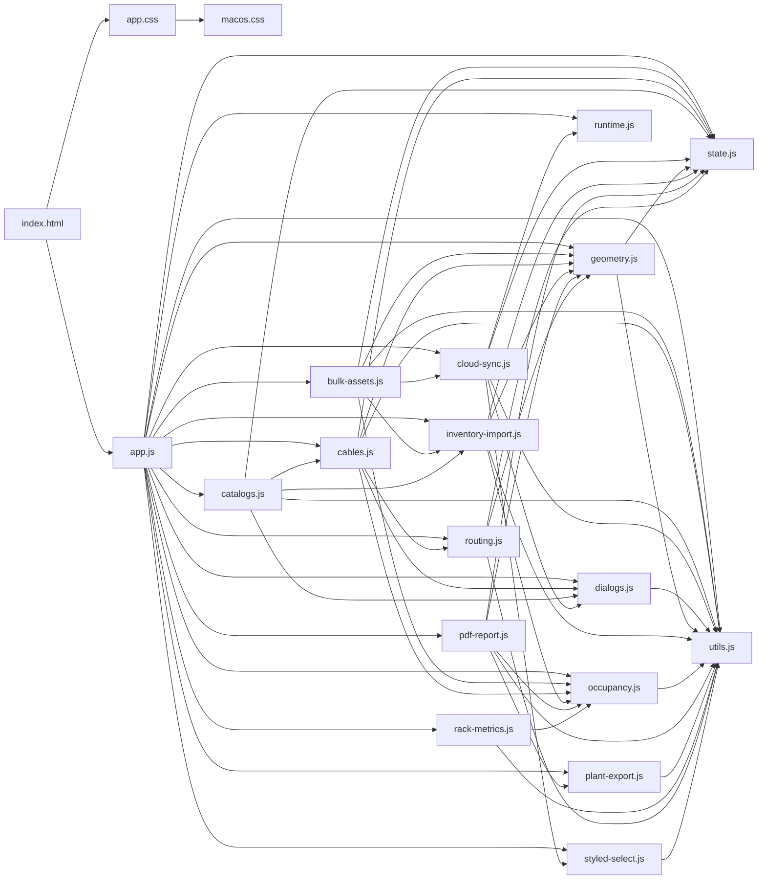

# SYSTEM-MAP — mapa do projeto

Gerado por `node scripts/system-map.mjs`. **Rode o script depois de mexer no código** para o
mapa continuar valendo (ele lê as linhas de verdade, não é escrito à mão).

Última geração: 2026-09-21 17:16 · app.js com 4473 linhas · 16 módulos em js/ · app.css 11276 · macos.css 3594

## 1. O que é o quê

| arquivo | papel |
|---|---|
| index.html | casca: barra de topo, duas laterais flutuantes, canvas, barra inferior e todos os modais |
| app.js | orquestra tudo: estado, render, interação do canvas e das laterais (`4473` linhas) |
| js/state.js | objeto `state` compartilhado (fonte da verdade em memória) |
| js/geometry.js | posições físicas de fileira/rack/calha + rótulo do rack (`rackDisplayName`, `findRackByLabel`) |
| js/routing.js | grafo de rota e cálculo de metragem de cabo |
| js/occupancy.js | ocupação de U por face, conflito e posição de asset |
| js/cables.js | lista de cabos, import/export XLSX e painel do cabo |
| js/catalogs.js | cadastros (tipos, fabricantes, modelos, salas) |
| js/bulk-assets.js + js/inventory-import.js | edição em massa e importação de planilha de assets |
| js/cloud-sync.js | salvar/carregar projeto na nuvem + status "Salvo" |
| js/rack-metrics.js | métricas do mapa de calor/resumo, sem DOM |
| app.css | camada base de estilo (tema claro e escuro por variáveis) |
| macos.css | camada de acabamento, **carregada depois do app.css** — quando as duas definem a mesma coisa, vale esta |

## 2. Módulos de js/ (exports e dependências)

| módulo | linhas | exporta (nome:linha) | importa de |
|---|---|---|---|
| `js/bulk-assets.js` | 189 | configureBulkAssets:13, addBulkRow:162, openBulkAssetsModal:168, closeBulkAssetsModal:169, saveBulkAssets:170, openAssetsImportModal:178, bindImportUI:182 | utils.js, state.js, occupancy.js, inventory-import.js, cloud-sync.js, geometry.js |
| `js/cables.js` | 510 | cables:10, configureCables:16, addCable:21, downloadCableTemplate:114, importCablesXLSX:156, closeCableTypeReviewModal:211, processCableImportRows:215, cableSummaryRows:288, … | utils.js, state.js, dialogs.js, geometry.js, routing.js, occupancy.js |
| `js/catalogs.js` | 455 | catalogs:9, configureCatalogs:16, DEFAULT_ASSET_TYPES:22, DEFAULT_ASSET_STATUSES:23, DEFAULT_ASSET_SUBSTATUSES:24, normalizeAssetCatalogs:25, bayfaceTypeColor:63, renderCableTypesCatalog:65, … | utils.js, state.js, dialogs.js, inventory-import.js, cables.js |
| `js/cloud-sync.js` | 1184 | cloud:9, configureCloudSync:17, setCloudStatus:70, updatePlannerProjectName:89, assetLogDiff:132, recordAssetAudit:175, openAssetHistory:486, closeAssetHistory:523, … | utils.js, state.js, dialogs.js, styled-select.js, runtime.js |
| `js/dialogs.js` | 80 | uiConfirm:19, uiPrompt:44 | utils.js |
| `js/geometry.js` | 391 | VIEW_PAD:8, rowForRack:11, rackDisplayName:15, findRackByLabel:24, rowIndex:44, racksInRow:45, rackAt:46, makeRack:52, … | state.js, utils.js |
| `js/inventory-import.js` | 790 | importSession:9, configureInventoryImport:19, assetStatusValues:46, makeAssetsTemplate:47, validateAssetImportRows:214, renderEditableAssetImportPreview:357, updateImportPreviewSummary:421, closeImportPreview:450, … | utils.js, state.js, occupancy.js, geometry.js |
| `js/occupancy.js` | 102 | isAssetArchived:11, assetOccupancy:15, assetsOnFace:26, assetAtRackU:31, assetsAtRackU:35, assetOwningPort:40, assetConflicts:45, occupiedUnits:57, … | utils.js |
| `js/pdf-report.js` | 376 | configurePdfReport:11, generatePDFReport:143, openPdfReportOptions:326, closePdfReportOptions:375 | utils.js, state.js, occupancy.js, geometry.js, plant-export.js |
| `js/plant-export.js` | 187 | capturePlant:45, composePlantSvg:98, bareSvg:129, svgToPngBlob:135, blobToDataUrl:152, downloadBlob:161, niceScale:171, safeFileName:175, … | utils.js |
| `js/rack-metrics.js` | 106 | HEAT_MODES:9, levelForRatio:13, rackMetrics:27, computeRackMetrics:60, heatLevel:73, summarizeRackMetrics:85 | utils.js, occupancy.js |
| `js/routing.js` | 399 | rackCableRiseMeters:15, ensureInfrastructureJunctions:23, buildRouteGraph:34, shortestPathNodes:247, calcAutomaticTrayLength:264, routePointsForAutomatic:275, dedupeRoutePoints:290, routeBetweenRacks:293, … | state.js, utils.js, geometry.js |
| `js/runtime.js` | 6 | GLOBAL_STORAGE:4, runtime:5 | — |
| `js/state.js` | 30 | THEME_STORAGE:3, state:16 | — |
| `js/styled-select.js` | 45 | closeStyledSelectPanels:6, syncSelectButton:7, openStyledSelectPanel:14, bindStyledSelect:39 | utils.js |
| `js/utils.js` | 139 | $:2, beginTask:9, endTask:19, uid:26, UI_ICONS:30, uiIcon:46, cloneData:50, esc:57, … | — |

## 3. app.js — funções por área

### Render / pintura

`updateRoomUI` (68) · `updateStructureControls` (128) · `updateHistoryButtons` (243) · `updateRenamePreview` (1009) · `updateHeatControl` (1071) · `renderRoomSummary` (1269) · `render` (1306) · `updateAlertsCenterBadge` (1718) · `updateAssetUFieldsState` (1874) · `refreshAssetRackOptions` (1902) · `renderAssetPortsEditor` (1941) · `updateAssetLifecycleBadge` (2057) · `updateAssetNotesCount` (2070) · `renderAssetsTableHead` (2296) · `renderAssetsKpis` (2350) · `renderAssetsFilterBar` (2367) · `renderAssetsPagination` (2376) · `renderAssetsTableSort` (2418) · `updateAssetsBulkBar` (2425) · `renderAssetsList` (2509) · `renderBayfaceAssetPicker` (2596) · `fitBayfaceHeight` (2752) · `renderBayface` (2823) · `renderProperties` (2939) · `renderPropertiesBody` (2950) · `refreshCableValidation` (3154) · `updateCableAssetNameField` (3166) · `renderCableProperties` (3192) · `updateCableResult` (3345) · `renderManualRouteUI` (3369) · `refreshVisuals` (3379) · `updateCanvasEmptyHint` (3418) · `renderAll` (3423) · `updateProjectSummary` (3831) · `renderQuickSearchResults` (3890) · `renderTopSearchResults` (3904) · `centerOnPoint` (3939) · `updateMinimap` (4020)

### Ligações de UI (setup/bind)

`bindRowPanelActions` (626) · `bindRowReorder` (740) · `bindSectionCollapse` (871) · `setupFocusMode` (942) · `setupSummaryRefit` (1098) · `setupEnvAdvanced` (1106) · `setupPlantExport` (1129) · `setupHeatControl` (1137) · `setupRackTooltip` (1176) · `bindAssetColumnResize` (2243) · `bindPropPanel` (2886) · `setupPropCards` (2935) · `bindCablePanelSections` (3320) · `bindManualRouteControls` (3363) · `setupPropSectionResize` (3492) · `setupPan` (3631) · `bindTopSearch` (3919) · `setupMinimap` (4081) · `setupSidebarToggle` (4134) · `setupStructureLockControl` (4156) · `bind` (4168)

### Criação e edição de dados

`applyRoomData` (40) · `applyTheme` (170) · `addRow` (572) · `removeRackReferences` (581) · `resizeRow` (588) · `deleteRow` (608) · `addRowFromPanel` (662) · `applyRenameRow` (1021) · `createIndependentTray` (1051) · `deleteAsset` (2161) · `applyAssetColumnWidths` (2239) · `assignBayfaceAsset` (2651) · `deleteSelectedTrays` (3465) · `deleteSelectedRacks` (3479)

### Busca

`rowMatchesSearch` (636) · `searchableItems` (3840) · `searchListHtml` (3885) · `renderQuickSearchResults` (3890) · `closeTopSearch` (3899) · `renderTopSearchResults` (3904) · `clearTopSearch` (3918) · `bindTopSearch` (3919) · `activateSearchResult` (3947) · `openQuickSearch` (3990) · `closeQuickSearch` (3991)

### Cálculos (geometria/rota)

`rowAddButtonHtml` (619) · `rowMatchesSearch` (636) · `computeStats` (1063) · `rackTooltipHtml` (1158)

### Cascas e modais

`addRowFromPanel` (662) · `buildRowsPanel` (670) · `openRenameRowModal` (955) · `closeRenameRowModal` (972) · `openRenameRowsModal` (974) · `closeAlertsCenterPanel` (1777) · `openAlertsCenterPanel` (1778) · `openAssetModal` (2016) · `closeAssetModal` (2056) · `openAssetsModal` (2565) · `closeAssetsModal` (2566) · `bindPropPanel` (2886) · `openHelpModal` (3984) · `closeHelpModal` (3985)

### Outras

`roomDataFromState` (39) · `syncActiveRoom` (41) · `migrateGlobalAssets` (42) · `ensureRooms` (52) · `switchRoom` (56) · `fitTopbarSelect` (57) · `switchLocation` (81) · `normalizeCableCatalogs` (94) · `cableTypeNames` (106) · `defaultCableType` (107) · `cableTypeColor` (108) · `isStructureLocked` (112) · `setStructureLock` (113) · `structureBlocked` (137) · `projectSnapshot` (141) · `historyContextKey` (188) · `initHistory` (191) · `persistHistoryContext` (210) · `recordHistory` (214) · `restoreSnapshot` (248) · `undo` (312) · `redo` (326) · `toast` (341) · `flashElement` (346) · `focusPanelItem` (356) · `flashSelection` (361) · `save` (370) · `load` (371) · `normalizeIndices` (399) · `normalizeState` (408) · `structureRebuildImpact` (477) · `structureRebuildMessage` (498) · `rebuildStructureFromSettings` (512) · `sectionHeadHeight` (786) · `animateSectionCollapse` (802) · `setRenameModalHint` (988) · `buildRenameNames` (989) · `renameTargets` (1001) · `renameConflict` (1005) · `migrateLegacyTrays` (1034) · `assetLifecycleLevel` (1062) · `positionHeatPill` (1082) · `exportPlant` (1114) · `pctText` (1156) · `kgText` (1157) · `summaryMeter` (1220) · `roomSummaryData` (1226) · `roomSummaryHtml` (1246) · `assetRoom` (1682) · `findRackGlobal` (1686) · `assetRack` (1692) · `assetRackLabel` (1695) · `assetRackRoom` (1699) · `assetWarrantyLevel` (1705) · `assetEndOfLifeLevel` (1706) · `assetsNeedingAttention` (1711) · `allProjectRacks` (1739) · `capacityIssues` (1745) · `positionIssues` (1768) · `openAssetsModalWithAttentionFilter` (1833)

## 4. Onde mexer quando…

| quero mudar… | mexer em |
|---|---|
| divisão Propriedades × Cabos (arrasto) | `setupPropSectionResize` (app.js) — grava `__dccpRightSplit`; altura de cada um |
| recolher/expandir de um cartão | `bindSectionCollapse` + `animateSectionCollapse` (app.js) e `.collapsed` no macos.css |
| estética da barra de topo | bloco **"Barra de topo — estilo plano"**, no fim do macos.css (vence por vir depois) |
| busca da barra | `searchableItems`, `searchListHtml`, `renderTopSearchResults` (app.js) + `#topSearchWrap` no index.html |
| lista de cabos (linha, botão excluir) | `renderCables` em js/cables.js |
| nome do rack com a fileira (A-101) | `rackDisplayName` / `findRackByLabel` em js/geometry.js |
| exportar/importar planilha | js/inventory-import.js, `exportAssetsXLSX` (app.js), `exportCablesXLSX` (js/cables.js) |
| rotas e metragem do cabo | js/routing.js |
| ocupação de U / choque de posição | js/occupancy.js |
| salvar na nuvem e status | js/cloud-sync.js (`setCloudStatus`) |
| minimapa, zoom e barra inferior | `setupPan`, `setupMinimap`, `.canvas-zoom-bar` / `.heat-control` |

## 5. Estado e persistência

- `state` (js/state.js) guarda: `rows`, `racks`, `trays`, `cables`, `assets`, `rooms` (cada sala com `data`),
  catálogos, `selected` / `multiSelected` / `trayMultiSelected` e as medidas padrão (U, largura, profundidade…).
- O projeto vive na nuvem: `save()` (app.js) agenda o envio e a sala ativa é copiada para `room.data` por
  `syncActiveRoom()`.
- Chaves de `localStorage` usadas: `dc-planner-v6`, `dc-planner-heat-mode`, `dc-planner-env-advanced`, `dccp_hint_dismissed` (mais `dccp-collapse-<painel>` e `dccp-split-cabos`).

## 6. index.html — pontos de montagem

| marco | linha |
|---|---|
| topbar | 392 |
| sidebar left | 671 |
| sidebar right | 1042 |
| canvasWrap | 911 |
| heatControl | 916 |
| quickSearchModal | 1215 |

Ids (406) e suas linhas estão no fim deste arquivo, na seção 8.

## 7. CSS

### Seções do tema (macos.css)

- Stratum — camada de identidade visual "Console Óptico" — linha 1
- Busca geral na barra de topo — linha 471
- Tipografia de painel e barras laterais — linha 625
- Cabeçalho: topbar e barra da planta — linha 704
- Controles flutuantes sobre a planta — linha 1087
- Ajuda — linha 1152
- Barra inferior da planta: zoom, camadas e exportar — linha 1249
- Editor de cadastro (modelos): sheet em dois passos numerados — linha 1518
- Aba Propriedades: cabeçalho contextual e painel do cabo — linha 1967
- Aba Propriedades: painel do rack — linha 2369
- Racks na planta: faceplate de metal anodizado — linha 3197
- Barra de topo — estilo plano (referência do cliente) — linha 3379

Regras com `:not(#\9)` (truque de especificidade para vencer o app.css): linhas
34, 37, 51, 59, 64, 68, 77, 83, 86, 91, 95, 100, 101, 102, 108, 109, 110, 115, 125, 130, 136, 737, 746, 969, 2698, 2704, 3414, 3415, 3418, 3421, ….

## 8. Ids do index.html

`authScreen` 42 · `authTheme` 45 · `authLoginView` 60 · `loginForm` 63 · `loginEmail` 66 · `loginPassword` 75 · `loginError` 93 · `btnLogin` 94

`showSignup` 99 · `showForgot` 101 · `btnGuestMode` 106 · `authSignupView` 110 · `signupForm` 113 · `signupEmail` 116 · `signupPassword` 125 · `signupPassword2` 147

`signupMessage` 166 · `btnSignup` 167 · `showLoginFromSignup` 172 · `authForgotView` 177 · `forgotForm` 182 · `forgotEmail` 185 · `forgotMessage` 191 · `btnForgot` 192

`showLoginFromForgot` 197 · `authResetView` 202 · `resetForm` 205 · `resetPassword` 209 · `resetPassword2` 230 · `resetMessage` 248 · `btnResetPassword` 252 · `authLoading` 258

`dashboardScreen` 264 · `dashboardUserEmail` 278 · `dashboardTheme` 280 · `dashboardLogout` 285 · `dashboardNewProject` 298 · `projectsSearch` 311 · `projectsSort` 318 · `projectsSortBtn` 330

`projectsViewList` 351 · `projectsViewGrid` 361 · `projectsSplit` 374 · `projectsGrid` 375 · `projectsPreview` 376 · `projectsEmpty` 378 · `dashboardNewProjectEmpty` 386 · `mainTopbar` 392

`sidebarToggle` 402 · `btnUndo` 415 · `btnRedo` 425 · `btnTheme` 437 · `btnProjects` 449 · `topSearchWrap` 461 · `topSearch` 467 · `topSearchResults` 478

`locationSelect` 487 · `locationSelectBtn` 494 · `roomSelect` 509 · `roomSelectBtn` 516 · `btnLocations` 529 · `autosaveLabel` 542 · `autosaveToggle` 545 · `cloudStatus` 553

`btnSave` 559 · `btnImportProject` 569 · `btnExport` 579 · `btnPdfReport` 589 · `btnAddTray` 600 · `btnAssets` 605 · `btnCatalogs` 615 · `btnAlertsCenter` 625

`alertsCenterCount` 634 · `btnHelp` 636 · `userMenuBtn` 640 · `userAvatar` 647 · `authUserEmail` 652 · `btnLogout` 654 · `projectInput` 663 · `envCollapse` 684

`btnReset` 697 · `projectName` 710 · `rowCount` 718 · `defaultRacks` 729 · `rackUnits` 741 · `envAdvancedToggle` 748 · `envAdvanced` 759 · `rackWidth` 766

`rackDepth` 777 · `rackGap` 789 · `rackPowerCapacity` 804 · `rackWeightCapacity` 819 · `defaultRowGap` 830 · `lastUToTray` 841 · `defaultSlack` 852 · `btnBuildRows` 859

`rowsCollapse` 880 · `rowsSearch` 900 · `rowsPanel` 907 · `canvasWrap` 911 · `canvasStage` 912 · `layout` 913 · `heatControl` 916 · `btnExportPlant` 932

`plantExportMenu` 935 · `structureLock` 941 · `structureLockIcon` 947 · `heatLegend` 954 · `canvasZoomBar` 957 · `zoomOut` 962 · `zoomRange` 973 · `zoomIn` 983

`zoomReset` 994 · `zoomFit` 1003 · `rackTooltip` 1014 · `canvasEmptyHint` 1015 · `canvasEmptyHintClose` 1018 · `canvasEmptyHintHelp` 1031 · `minimap` 1037 · `minimapSvg` 1038

`propHeadIcon` 1046 · `propHeadTitle` 1048 · `propHeadSubtitle` 1049 · `propCollapse` 1055 · `propTitleSticky` 1067 · `properties` 1069 · `propSectionResize` 1074 · `cablesCollapse` 1091

`cableCount` 1103 · `btnAddCablePanel` 1105 · `btnImport` 1117 · `btnTemplate` 1128 · `btnExportCables` 1139 · `excelInput` 1150 · `cablesSelectAll` 1161 · `cablesSearch` 1166

`cablesFilter` 1173 · `cablesFilterBtn` 1184 · `cablesBulkBar` 1196 · `cablesBulkCount` 1200 · `cablesBulkClear` 1204 · `cablesBulkDelete` 1206 · `cablesList` 1211 · `quickSearchModal` 1215

`quickSearchTitle` 1230 · `quickSearchClose` 1234 · `quickSearchInput` 1245 · `quickSearchResults` 1251 · `projectSummaryModal` 1261 · `projectSummaryTitle` 1283 · `summaryProjectName` 1284 · `summaryClose` 1287

`projectSummaryGrid` 1295 · `toast` 1298 · `assetsModal` 1300 · `assetsTitle` 1317 · `assetsBulk` 1321 · `assetsExport` 1326 · `assetsNew` 1331 · `assetsClose` 1336

`assetsKpiRow` 1344 · `assetsSearch` 1349 · `assetsFilterBar` 1355 · `assetsClearFilters` 1473 · `assetsAttentionBanner` 1481 · `assetsAttentionClear` 1485 · `assetsBulkBar` 1491 · `assetsSelectedCount` 1495

`assetsBulkStatus` 1500 · `assetsBulkStatusBtn` 1504 · `assetsBulkSubstatus` 1520 · `assetsBulkSubstatusBtn` 1524 · `assetsBulkLocation` 1542 · `assetsBulkLocationBtn` 1546 · `assetsBulkClear` 1564 · `assetsBulkDelete` 1566

`assetsTableHead` 1572 · `assetsSelectAll` 1576 · `assetsList` 1918 · `assetsSelectedCountFooter` 1922 · `assetsPageSize` 1926 · `assetsPageRange` 1933 · `assetsPageButtons` 1936 · `assetHistoryModal` 1942

`assetHistoryTitle` 1960 · `assetHistorySubtitle` 1961 · `assetHistoryExport` 1968 · `assetHistoryClose` 1978 · `assetHistoryAssetName` 1998 · `assetHistoryUser` 2011 · `assetHistoryLocation` 2023 · `assetHistoryStatusIcon` 2027

`assetHistoryStatus` 2035 · `assetHistorySearch` 2047 · `assetHistoryType` 2054 · `assetHistoryField` 2059 · `assetHistoryDate` 2064 · `assetHistoryRange` 2068 · `assetHistoryDateFrom` 2072 · `assetHistoryDateTo` 2080

`assetHistoryCount` 2086 · `assetHistoryList` 2088 · `assetCatalogModal` 2094 · `assetCatalogTitle` 2112 · `assetCatalogClose` 2120 · `catalogTypeSearch` 2179 · `catalogTypes` 2185 · `catalogCableTypeAdd` 2227

`catalogCableTypeSearch` 2235 · `catalogCableTypes` 2241 · `catalogManufacturerSearch` 2293 · `catalogManufacturers` 2299 · `catalogModelAdd` 2342 · `catalogModelSearch` 2350 · `catalogModelType` 2358 · `catalogModelManufacturer` 2362

`catalogModels` 2367 · `catalogStatusSearch` 2416 · `catalogStatuses` 2422 · `catalogSubstatusSearch` 2474 · `catalogSubstatuses` 2480 · `catalogLocationSearch` 2505 · `catalogLocationAdd` 2514 · `catalogLocations` 2519

`locationsFooter` 2522 · `locationsFooterStats` 2523 · `catalogImportFile` 2534 · `assetsImportFile` 2535 · `assetsImportModal` 2537 · `assetsImportTitle` 2554 · `assetsImportClose` 2561 · `assetsImportDrop` 2569

`assetsImportChoose` 2579 · `assetsImportTemplate` 2598 · `assetsImportFileInfo` 2608 · `assetsImportMapping` 2610 · `assetsImportBack` 2614 · `assetsImportCancel` 2621 · `assetsImportContinue` 2624 · `importPreviewModal` 2636

`importPreviewTitle` 2654 · `importPreviewSubtitle` 2655 · `importPreviewClose` 2660 · `importPreviewSummary` 2668 · `importPreviewErrors` 2670 · `importPreviewTable` 2673 · `importPreviewFooterStats` 2676 · `importPreviewCancel` 2679

`importPreviewConfirm` 2682 · `importPreviewConfirmLabel` 2691 · `catalogEditorModal` 2697 · `catalogEditorTitle` 2715 · `catalogEditorSubtitle` 2716 · `catalogEditorClose` 2722 · `catalogEditorKind` 2730 · `catalogEditorId` 2731

`catalogStepBasic` 2734 · `catalogStepBasicTitle` 2737 · `catalogStepBasicHint` 2738 · `catalogEditorNameLabel` 2744 · `catalogEditorName` 2748 · `catalogEditorTypeWrap` 2756 · `catalogEditorType` 2762 · `catalogEditorManufacturerWrap` 2767

`catalogEditorManufacturer` 2773 · `catalogEditorPowerWrap` 2778 · `catalogEditorPowerW` 2782 · `catalogEditorWeightWrap` 2794 · `catalogEditorWeightKg` 2798 · `catalogEditorPortsWrap` 2813 · `catalogPortDefsList` 2822 · `catalogPortDefsTotal` 2823

`portRangeStart` 2841 · `portRangeEnd` 2849 · `portRangePoe` 2857 · `portRangeAdd` 2861 · `portSingleName` 2889 · `portSinglePoe` 2896 · `portSingleAdd` 2900 · `catalogEditorHelpText` 2915

`catalogEditorCancel` 2921 · `catalogEditorSave` 2926 · `catalogEditorSaveLabel` 2930 · `assetsBulkModal` 2935 · `assetsBulkTitle` 2950 · `assetsBulkClose` 2954 · `assetsBulkChooser` 2962 · `assetsBulkManual` 2969

`assetsBulkImport` 2987 · `assetsBulkEditor` 3006 · `assetsBulkAddRow` 3016 · `assetsBulkSummary` 3018 · `assetsBulkBody` 3076 · `assetsBulkBack` 3080 · `assetsBulkCancel` 3084 · `assetsBulkSave` 3086

`assetEditModal` 3094 · `assetEditTitle` 3110 · `assetEditHistory` 3117 · `assetEditCancelTop` 3124 · `assetEditNav` 3134 · `assetEditContent` 3172 · `assetEditForm` 3173 · `assetEditId` 3174

`assetStepDados` 3175 · `assetName` 3195 · `assetTag` 3213 · `assetSerial` 3223 · `assetLocation` 3238 · `assetRack` 3246 · `assetUStart` 3254 · `assetUHeight` 3269

`assetFace` 3287 · `assetStepEspec` 3305 · `assetType` 3321 · `assetManufacturer` 3330 · `assetModel` 3339 · `assetStatus` 3353 · `assetSubstatus` 3363 · `assetPowerW` 3372

`assetWeightKg` 3387 · `assetStepPortas` 3397 · `assetPortsExport` 3407 · `assetPortsAdd` 3417 · `assetPortsCount` 3426 · `assetPortsUsedCount` 3428 · `assetPortsToggle` 3433 · `assetPortsList` 3444

`assetStepCiclo` 3452 · `assetLifecycleBadge` 3460 · `assetPurchaseDate` 3471 · `assetWarrantyExpiration` 3480 · `assetEndOfLife` 3488 · `assetNotes` 3493 · `assetNotesCount` 3497 · `assetEditCancel` 3504

`bayfaceModal` 3515 · `bayfaceTitle` 3532 · `bayfaceClose` 3536 · `bayfaceContent` 3544 · `bayfaceAssetPickerModal` 3548 · `bayfaceAssetPickerTitle` 3568 · `bayfaceAssetPickerSubtitle` 3569 · `bayfaceAssetPickerClose` 3574

`bayfaceAssetPickerSearch` 3588 · `bayfaceAssetPickerCount` 3594 · `bayfaceAssetPickerList` 3611 · `bayfaceAssetPickerRange` 3614 · `bayfaceAssetPickerPrev` 3617 · `bayfaceAssetPickerPage` 3624 · `bayfaceAssetPickerNext` 3626 · `renameRowModal` 3637

`renameRowTitle` 3652 · `renameCancelTop` 3656 · `renameRowId` 3664 · `renamePrefix` 3668 · `renameStart` 3674 · `renamePad` 3683 · `renamePreview` 3695 · `renameRowError` 3696

`renameCancel` 3698 · `renameApply` 3699 · `uiConfirmModal` 3705 · `uiConfirmIcon` 3713 · `uiConfirmTitle` 3723 · `uiConfirmSubtitle` 3724 · `uiConfirmBody` 3727 · `uiConfirmPromptWrap` 3728

`uiConfirmPromptLabel` 3732 · `uiConfirmPromptInput` 3735 · `uiConfirmPromptError` 3736 · `uiConfirmCancel` 3739 · `uiConfirmOk` 3742 · `roomEditorModal` 3748 · `roomEditorTitle` 3763 · `roomEditorClose` 3767

`roomEditorForm` 3775 · `roomEditorId` 3776 · `roomEditorName` 3777 · `roomEditorCooling` 3782 · `roomEditorThermalReadout` 3788 · `roomEditorCancel` 3795 · `helpModal` 3805 · `helpTitle` 3821

`helpClose` 3825 · `pdfReportOptionsModal` 4033 · `pdfReportOptionsTitle` 4051 · `pdfReportOptionsClose` 4055 · `pdfReportOptionsForm` 4063 · `pdfOptPlant` 4066 · `pdfOptSummary` 4071 · `pdfOptStatus` 4076

`pdfOptLifecycle` 4081 · `pdfOptCables` 4086 · `pdfRacksSelectAll` 4098 · `pdfRacksSelectNone` 4104 · `pdfRacksList` 4110 · `pdfReportOptionsCancel` 4113 · `cableTypeReviewModal` 4121 · `cableTypeReviewTitle` 4139

`cableTypeReviewClose` 4146 · `cableTypeReviewList` 4158 · `cableTypeReviewCancel` 4160 · `cableTypeReviewConfirm` 4163 · `taskBar` 4173 · `taskBarLabel` 4180

## 9. Testes e verificação

- `node --test "js/test/*.test.mjs"` — 8 arquivos de teste,
  cobrindo geometria, rota, ocupação, utilitários, versões e exportação da planta.
- `node scripts/bump-version.mjs css` — sobe a versão dos módulos e do CSS em index.html (cache do navegador).
- `cmd /c "node --input-type=module --check < app.js"` — checagem de sintaxe do app.js.
- `node scripts/system-map.mjs` — regenera este arquivo.

### Como eu meço mudanças de UI

Para qualquer mudança visual, subo o app no Edge headless com CDP (perfil temporário,
`--allow-file-access-from-files`), entro pelo modo convidado (`#btnGuestMode`), monto uma
estrutura pelo formulário (`rowCount` + `defaultRacks` + `#btnBuildRows` → `#uiConfirmOk`) e
meço o DOM (`getBoundingClientRect`) em vez de julgar pelo olho. Os scripts de medição ficam em
`%TEMP%\stratum-measure\*`. Para o tema claro, gravo `dc-planner-theme-v3=light` e recarrego.
